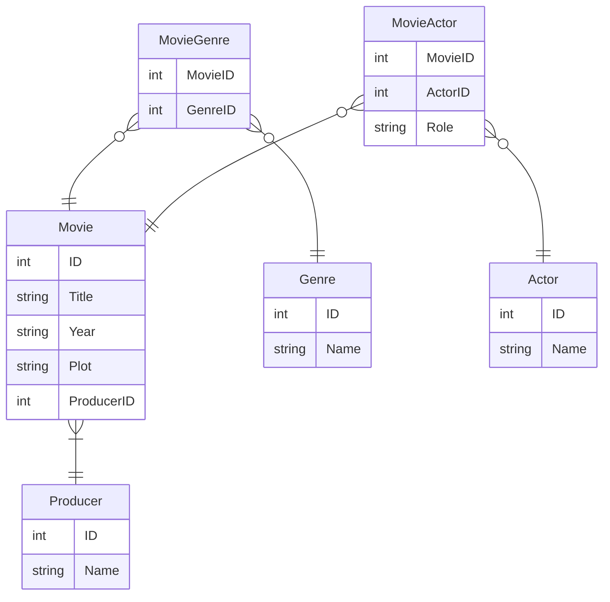

EX5

# 1.
| ++MovieID++ | Title | Year | (GenreID, Name) | (ActorID, Name, Role) | Plot | ProducerID | ProducerName |
| - |

# 2.
Dependências:
MovieID → { Title, Year, (GenreID), (ActorID), Plot, ProducerID }
GenreID → Name
ActorID → Name 
ProducerID → ProducerName

# 3.
Nenhuma, pois os valores da tabela não são atômicos.

# 4.
### 1FN
~Movie~
| ++ID++ | Title | Year | Plot | ProducerID | ProducerName | 
| - |

~Genre~
| ++GenreID++ | ++MovieID++ | Name |
| - |
Genre.MovieID → Movie.ID

~ActorMovie~
| ++ActorID++ | ++MovieID++ | Name | Role |
| - |
Actor.MovieID → Movie.ID

### 2FN
~Movie~
| ++ID++ | Title | Year | Plot | ProducerID | 
| - |
Movie.ProducerID → Producer.ID

~Producer~
| ++ID++ | Name | 
| - |

~Genre~
| ++ID++ | Name |
| - |

~MovieGenre~
| ++MovieID++ | ++GenreID++ |
| - |
MovieGenre.MovieID → Movie.ID
MovieGenre.GenreID → Genre.ID

~Actor~
| ++ID++ | Name |
| - |

~MovieActor~
| ++MovieID++ | ++ActorID++ | Role |
| - |
MovieActor.MovieID → Movie.ID
MovieActor.ACtorID → Actor.ID

### 3FN
Sem mudança.

# 4.
